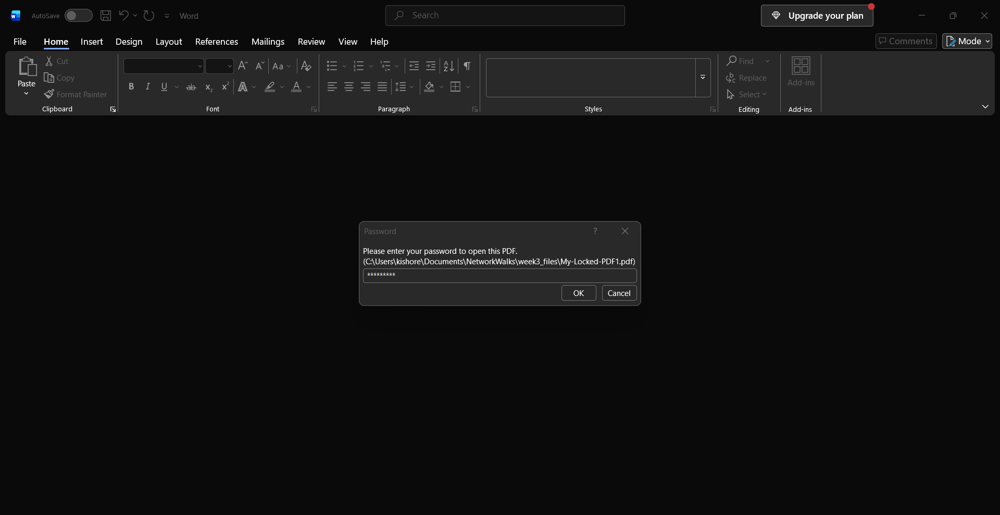
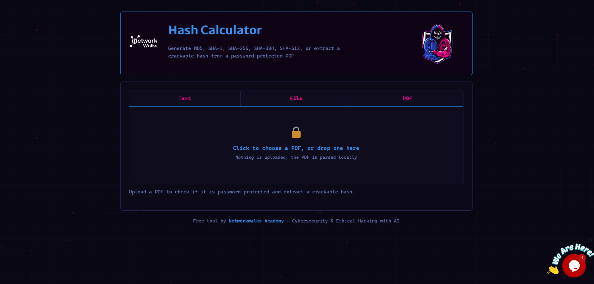
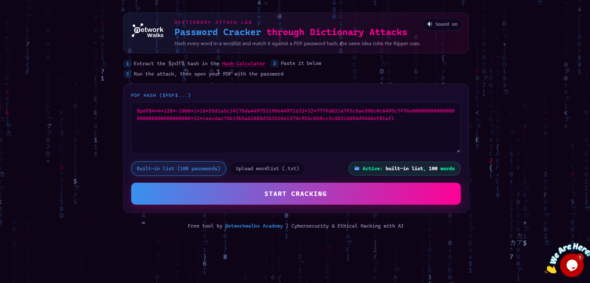
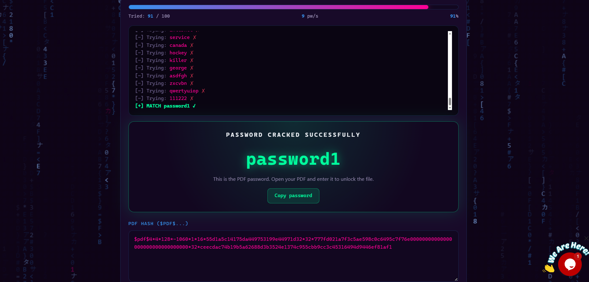

# NETWORKWALKS-B083-WK3-PM1-CYBERSECURITY-PASSWORD-SECURITY

## Password Security and Password Recovery Lab

This repository contains my **Week 3 cybersecurity internship practical work** completed as part of the Networkwalks Cybersecurity Training Program.

The practical focuses on **password security, password recovery, PDF hash analysis, John the Ripper, Johnny, and Networkwalks password-security tools**.

---

## Project Overview

Password security is an important part of cybersecurity because weak or reused passwords can increase the risk of unauthorized access.

In this practical, I worked with password-security tools in an authorized laboratory environment to understand:

* Password security concepts
* Password hashes
* Protected PDF files
* John the Ripper
* Johnny GUI
* Hash calculation
* Password recovery
* Password verification
* Security documentation

The practical was divided into **two modules**.

---

## Objectives

The main objectives of this practical were:

* Understand basic password-security concepts.
* Understand how password hashes are used.
* Work with a password-protected PDF.
* Perform an authorized password-recovery exercise.
* Use John the Ripper and Johnny.
* Calculate and analyze a PDF hash.
* Use the Networkwalks Password Cracker.
* Verify the recovered password.
* Document the practical activities using screenshots.
* Understand the importance of strong password protection.

---

# Module 1 — John the Ripper and Johnny

## Introduction

The first module focused on using **John the Ripper** and its graphical interface **Johnny** for a password-security practical.

The exercise involved working with a password-protected PDF and using the appropriate password-security workflow to perform password recovery in the authorized lab environment.

### Tools Used

* John the Ripper
* Johnny
* Password-protected PDF

### Workflow

```text
Password-Protected PDF
          ↓
      PDF Hash
          ↓
   Hash Processing
          ↓
 John the Ripper / Johnny
          ↓
   Password Recovery
          ↓
      Verification
```

---

## Module 1 — Practical Evidence

### Screenshot 1


### Screenshot 2


### Screenshot 3



### Screenshot 4


---

## Module 1 — Learning Outcome

From this module, I learned:

* Basic password-recovery concepts.
* How password-related hashes are used in security testing.
* The purpose of John the Ripper.
* How Johnny provides a graphical interface for John the Ripper.
* How to verify a recovered password against the authorized target.
* The importance of documenting each stage of a security exercise.

---

# Module 2 — Networkwalks Password Security Tools

## Introduction

The second module focused on password-security tools provided through the Networkwalks training environment.

The practical involved calculating the hash of a protected PDF and using the password-security workflow to perform an authorized password-recovery exercise.

### Tools Used

* Networkwalks Hash Calculator
* Networkwalks Password Cracker
* Web Browser
* Password-protected PDF

### Workflow

```text
Password-Protected PDF
          ↓
 Networkwalks Hash Calculator
          ↓
       PDF Hash
          ↓
 Networkwalks Password Cracker
          ↓
   Password Recovery
          ↓
      Verification
```

---

## Module 2 — Practical Evidence

### Screenshot 1



### Screenshot 2



### Screenshot 3



### Screenshot 4


---

## Module 2 — Learning Outcome

From this module, I learned:

* How hashes are used during password-security testing.
* How to obtain a hash from a protected file.
* How password-security tools process hash information.
* How password recovery can be performed in a controlled environment.
* How to verify the result.
* How to maintain proper evidence during cybersecurity activities.

---

# Key Security Concepts

## 1. Password Security

Password security involves protecting passwords and authentication information from unauthorized access.

Strong passwords should:

* Be difficult to guess.
* Be unique for different accounts.
* Avoid common words and predictable patterns.
* Not be reused across multiple services.

---

## 2. Password Hashing

A password hash is a transformed representation of password information.

Instead of storing passwords directly, secure applications should store passwords using appropriate password-hashing methods.

```text
Password
   ↓
Hashing Algorithm
   ↓
Password Hash
```

---

## 3. Password Recovery

Password-recovery tools can test possible passwords against password-related data.

In this practical, the recovery process was performed only against the **authorized laboratory target**.

---

## 4. Hash Analysis

Hashes can provide useful information during security testing.

The practical demonstrated the workflow of:

```text
Protected File
      ↓
Hash Extraction
      ↓
Hash Analysis
      ↓
Password-Security Testing
      ↓
Verification
```

---

# Module Comparison

| Feature      | Module 1                 | Module 2                      |
| ------------ | ------------------------ | ----------------------------- |
| Main Tool    | John the Ripper          | Networkwalks Password Cracker |
| Interface    | Johnny GUI               | Web Interface                 |
| Target       | Protected PDF            | Protected PDF                 |
| Hash         | PDF-related hash         | PDF-related hash              |
| Recovery     | John the Ripper workflow | Networkwalks workflow         |
| Verification | Yes                      | Yes                           |
| Evidence     | 4 Screenshots            | 4 Screenshots                 |

---

# Security Observations

The practical demonstrated several important password-security concepts:

* Weak passwords can be vulnerable to password-recovery techniques.
* Password hashes should be properly protected.
* Passwords should not be stored in plain text.
* Strong and unique passwords improve account security.
* Multi-factor authentication provides an additional layer of protection.
* Password-security testing should only be performed with proper authorization.

---

# Security Recommendations

The following practices can improve password security:

1. Use strong and unique passwords.
2. Avoid using the same password for multiple accounts.
3. Use multi-factor authentication.
4. Avoid predictable passwords and common password patterns.
5. Use secure password-hashing mechanisms in applications.
6. Protect password hashes from unauthorized access.
7. Regularly review authentication security.
8. Perform password-security testing only within an authorized scope.

---

# Skills Demonstrated

Through this practical, I gained hands-on exposure to:

* Password security
* Password hashing
* Hash analysis
* Password recovery concepts
* John the Ripper
* Johnny
* Networkwalks security tools
* Protected PDF analysis
* Security verification
* Evidence collection
* Cybersecurity documentation
* Ethical security testing

---

# Ethical and Legal Considerations

All activities documented in this repository were performed as part of an **authorized cybersecurity training exercise**.

Password-recovery and security-testing techniques should only be used on systems, files, or accounts for which proper authorization has been provided.

Unauthorized access or password recovery may violate organizational policies and applicable laws.

---

# Conclusion

Week 3 provided practical experience with **password security and password-recovery workflows**.

Through the two modules, I learned how password hashes are used in security testing and gained hands-on experience with **John the Ripper, Johnny, Networkwalks Hash Calculator, and Networkwalks Password Cracker**.

The practical also helped me understand the importance of strong passwords, secure password storage, proper verification, and authorized security testing.


# Author

**Kishore B**

B.E. Computer Science and Engineering
**Specialization:** Cyber Security
Jerusalem College of Engineering

---

# Internship Information

**Program:** Networkwalks Cybersecurity Internship
**Week:** 03
**Practical:** Password Security
**Focus Areas:** Password Hashing, Password Recovery, John the Ripper, Johnny, and Networkwalks Security Tools

---

## Disclaimer

This repository is created for **educational and cybersecurity training purposes**.

All testing activities were performed in an authorized laboratory environment. The techniques demonstrated should not be used against systems, files, accounts, or networks without explicit permission.
